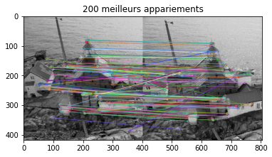
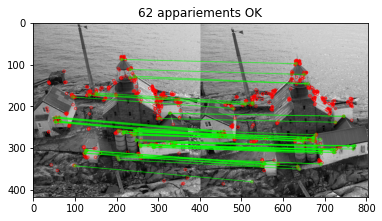

# Compte Rendu TP1 : Détection et Appariement de Points Caractéristiques

## 2 Formats d'images et convolutions

1. Expérimentation du code. 


2. Le noyau de convolution choisit permet de réaliser 
un réhausement de contraste car on multiplie la valeur
du pixel par 5 et on soustrait les valeurs des pixels autour.
La somme des coefficient vaut un donc en moyenne le niveau de 
gris reste identique, cependant la valeur du pixel considéré 
étant positive et celles des pixels autour étant négatives
cela permet de réhausser le contraste.


3. Pour avoir un affichage correct, il faut s'assurer de
prendre un vmin = -128 et un vmax = 128 dans la fonction
imshow().
```python
t1 = cv2.getTickCount()
kernel = np.array([[0, -1, 0],[-1, 5, -1],[0, -1, 0]])
kernel_dx = np.array([[-1,0,1]])
kernel_dy = kernel_dx.T
img3 = cv2.filter2D(img,-1,kernel)
img_3_dx = cv2.filter2D(img,-1,kernel_dx)
img_3_dy = cv2.filter2D(img,-1,kernel_dy)

cv2.imshow('Avec filter2D',img3/255.0)
cv2.waitKey(0)
plt.subplot(122)
plt.imshow(img_3_dx,cmap = 'gray',vmin = -128.0,vmax = 128.0)
```

Pour calculer la norme euclidienne du gradient de l'image on a rajouter la ligne de code suivante: 

    norm_img = np.sqrt(img_3_x**2 + img_3_y**2)

Pour l'affichage on a réutiliser vmin = 0 et vmax = 255 car on ne peut pas avori de norme négative.


## 3 Détecteurs

4. Pour obtenir les dérivées de l'image par rapport à x ou y, on utilise les convolutions définies précédemment.
Par suite, nous utilisons les fonctions déjà définies sur numpy pour faire les mises au carré, les sommes, le déterminant et la trace (pour une taille de fenêtre arbitraire et fixée):
```python
dx_square = img3_x**2
dy_square = img3_y**2
dx_dy = img3_x * img3_y
alpha = 0.06
W_h = h/100
W_w = w/100
for x in range(h):
    for y in range(w):
        sub_dxdx = dx_square[int(x - W_h/2):int(x + W_h/2)+1,int(y - W_w/2):int(y + W_w/2) + 1]
        sub_dxdy = dx_dy[int(x - W_h/2):int(x + W_h/2) + 1, int(y - W_w/2):int(y + W_w/2) + 1]
        sub_dydy = dy_square[int(x - W_h/2):int(x + W_h/2) + 1 , int(y - W_w/2):int(y + W_w/2) + 1]
        Ksi = np.array([[np.sum(sub_dxdx), np.sum(sub_dxdy)],[np.sum(sub_dxdx), np.sum(sub_dydy)]])
        interest = np.linalg.det(Ksi) - alpha * np.trace(Ksi)**2
        Theta[x, y] = interest
```
Grâce à la dilatation morphologique
```python
Theta_maxloc = cv2.copyMakeBorder(Theta,0,0,0,0,cv2.BORDER_REPLICATE)
d_maxloc = 3
seuil_relatif = 0.01
se = np.ones((d_maxloc,d_maxloc),np.uint8)
Theta_dil = cv2.dilate(Theta,se)
```

ainsi qu'au traitement par seuil pour les valeurs non significatives et ou qui ne sont pas des maxima locaux,
```python
#Suppression des non-maxima-locaux
Theta_maxloc[Theta < Theta_dil] = 0.0
#On néglige également les valeurs trop faibles
Theta_maxloc[Theta < seuil_relatif*Theta.max()] = 0.0
```

on arrive finalement à ce résultat:


La dilatation morphologique permet à elle seule d'avoir un maximum local sur chaque carré de pixels successivement, ainsi si un maximum plus grand se trouve à proximité, ce dernier deviendra le nouveau maximum. De plus, le fait de traiter par seuil permet d'éviter les valeurs parasites.

5. On remarque en faisant varier les différents paramètres que le nombre de points d'intérêt est inversemment proportionnel à l'épaisseur de la fenêtre (ici W représente la valeur par laquelle on divise la taille de l'image) et à alpha. En effet, pour un alpha fixé à 0.06, on obtient:


et pour un W fixer à 100, on a:


6. Le détecteur ORB utilise dans un premier temps la recherche
des filtres de différences gaussiennes pour sélectionner un
ensemble de points à hautes réponses puis il effectue une sélection
des points les plus stables dans l'espace d'échelle. ORB utilise
ensuite un algorithme de création de descripteurs pour associer les
points entre eux. KAZE quant à lui utilise un détecteur de
segment accéléré pour détecter les points d'intérêt puis il
les caractérise en utilisant le moment de Zernike. 

Les principaux paramètres de ORB sont :

  - nfeature : Le nombre maximum de points à détecter.
  - scaleFactor : Le facteur d'échelle utilisé. 
  - nlevels : Le nombre de niveaux d'échelles réalisés. En 
    augmentant le nombre de niveaux, on permet la détection
    de points d'intérêts à plis petite échelle, mais on augmente
    également le temps de calcul.

Les principaux paramètres de KAZE sont : 

  - upright : Si upright == True, le descripteur est calculé
    à partir d'une version redressée de l'image ce qui diminue
    le temps de calcul, mais également la précision.
  - treshold : Suprime les régions peut contraster de l'image.
  - nOctaves : Le nombre de niveaux d'échelles.
  - nOctaveslayers : Le nombre de sous niveaux dans chaque
    niveau d'échelle.
  - Diffusivity : Type de diffusion utilisé pour filtrer l'image.

Pour évaluer la répétabilité des détecteurs, on peut comparer 
les points d'intérêts détectés dans deux images différentes d'un
même objet. Le détecteur à une bonne répétabilité si les points d'intérêt sont 
les mêmes dans les deux images.

7. ORB génère des descripteurs binaires alors que KAZE génère des vecteurs de flottants.
Ils sont invariants par rotation car les orientations des points clés sont calculés et utilisés pour orienter
les patchs autour des points clés. Ils sont invariants aux changements d'échelles grâce à l'utilisation de différents niveaux d'échelles.

9. La méthode Cross Check (sur la première image) fonctionne avec une vérification croisé.
Elle élimine les appariements qui ne sont pas réciproques entre les deux images.

La méthode Ratio Test (sur la seconde image) sélectionne les appariements dont la distance
dont la distance entre les deux points d'intérêt est faible en comparaison avec les autres distances calculées.

La méthode FLANN (Nous n'avons pas réussi à exécuter le script à cause d'un problème de versionnage de cv2 que nous avons constaté trop tard)
crée un indice de points d'intérêts dans une image et recherche les points d'intérêts les plus proches dans l'autre.






ORB est basé sur des descripteurs binaires, la distance de Hamming semble donc toute indiqué. 
En revanche, les descripteurs utilisés par KAZE sont des vecteurs de nombres flottants, la norme euclidienne semble donc plus approprié.
 

9. Pour évaluer quantitativement la qualité des appariements en 
déformant l'image, on peut procéder de la sorte :
   - On sélectionne une paire d'image de la même scène.
   - On applique les détecteurs et les descripteurs aux deux images.
   - On réalise un appariement des points clefs des deux images.
   - On applique une transformation géométrique.
   - On transforme les points clés en utilisant la même transformation géométrique.
   - On calcul l'erreur de correspondance.

Ci-dessous un script pour réaliser ces étapes :


```python

import numpy as np
import cv2

detector = 2

img1 = cv2.imread('torb_small1.png')
print("Dimension de l'image 1 :",img1.shape[0],"lignes x",img1.shape[1],"colonnes")
print("Type de l'image 1 :",img1.dtype)
img2 = cv2.imread('torb_small2.png')
print("Dimension de l'image 2 :",img2.shape[0],"lignes x",img2.shape[1],"colonnes")
print("Type de l'image 2 :",img2.dtype)

#Début du calcul
t1 = cv2.getTickCount()
#Création des objets "keypoints"
if detector == 1:
  kp1 = cv2.ORB_create(nfeatures = 500,#Par défaut : 500
                       scaleFactor = 1.2,#Par défaut : 1.2
                       nlevels = 8)#Par défaut : 8
  kp2 = cv2.ORB_create(nfeatures=500,
                        scaleFactor = 1.2,
                        nlevels = 8)
  print("Détecteur : ORB")
else:
  kp1 = cv2.KAZE_create(upright = False,#Par défaut : false
    		        threshold = 0.001,#Par défaut : 0.001
  		        nOctaves = 4,#Par défaut : 4
		        nOctaveLayers = 4,#Par défaut : 4
		        diffusivity = 2)#Par défaut : 2
  kp2 = cv2.KAZE_create(upright = False,#Par défaut : false
	  	        threshold = 0.001,#Par défaut : 0.001
		        nOctaves = 4,#Par défaut : 4
		        nOctaveLayers = 4,#Par défaut : 4
		        diffusivity = 2)#Par défaut : 2
  print("Détecteur : KAZE")
#Conversion en niveau de gris
gray1 =  cv2.cvtColor(img1,cv2.COLOR_BGR2GRAY)
gray2 =  cv2.cvtColor(img2,cv2.COLOR_BGR2GRAY)
#Détection et description des keypoints
pts1, desc1 = kp1.detectAndCompute(gray1,None)
pts2, desc2 = kp2.detectAndCompute(gray2,None)
#Les points non appariés apparaîtront en gris 
img1 = cv2.drawKeypoints(gray1, pts1, None, color=(127,127,127), flags=0)
img2 = cv2.drawKeypoints(gray2, pts2, None, color=(127,127,127), flags=0)
t2 = cv2.getTickCount()
time = (t2 - t1)/ cv2.getTickFrequency()
print("Détection points et calcul descripteurs :",time,"s")
# Calcul de l'appariement
t1 = cv2.getTickCount()
if detector == 1:
  #Distance de Hamming pour descripteur BRIEF (ORB)
  bf = cv2.BFMatcher(cv2.NORM_HAMMING, crossCheck=True)
else:
  #Distance L2 pour descripteur M-SURF (KAZE)
  bf = cv2.BFMatcher(cv2.NORM_L2, crossCheck=True)
matches = bf.match(desc1,desc2)

src_pts = np.float32([pts1[m.queryIdx].pt for m in matches]).reshape(-1, 1, 2)
dst_pts = np.float32([pts2[m.trainIdx].pt for m in matches]).reshape(-1, 1, 2)
H, _ = cv2.findHomography(src_pts, dst_pts, cv2.RANSAC, 5.0)

# On déforme l'image avec une rotation de 45 degrés 
rows, cols = img2.shape[:2]
M = cv2.getRotationMatrix2D((cols/2, rows/2), 45, 1)
img2_transformed = cv2.warpAffine(img2, M, (cols, rows))

dst_pts_transformed = cv2.perspectiveTransform(dst_pts, H)

# Calculer la distance Euclidienne entre les correspondances correctes
correct_matches = []
for m in matches:
    p1 = pts1[m.queryIdx].pt
    p2 = pts2[m.trainIdx].pt
    p2_transformed = cv2.perspectiveTransform(np.array([p2]).reshape(-1, 1, 2), H)
    dist = np.linalg.norm(p1 - p2_transformed)
    if dist < 10: 
        correct_matches.append(m)


correct_ratio = float(len(correct_matches)) / float(len(matches))
print("Le taux de correspondance est de : " + str(correct_ratio))
```

            
