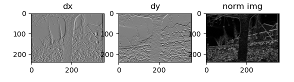
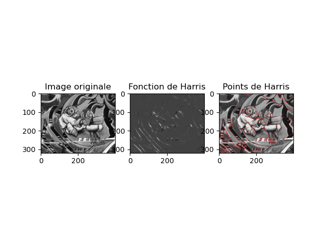
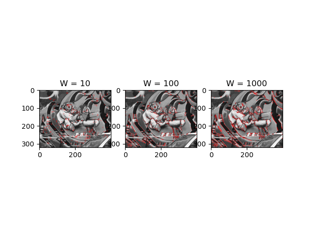
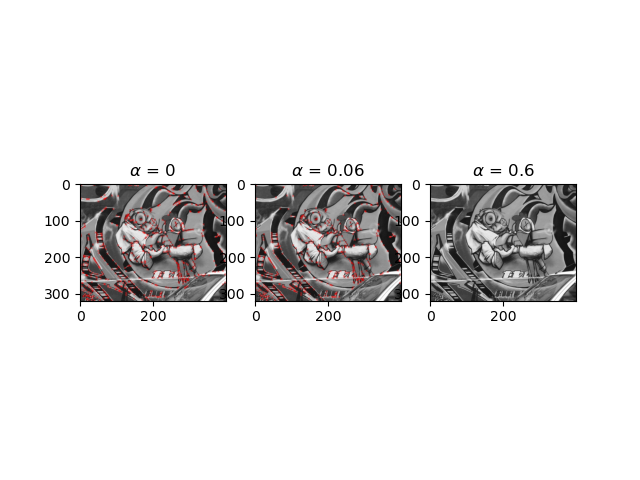

# Compte Rendu TP1 : Détection et Appariement de Points Caractéristiques

## 2 Formats d'images et convolutions

1. Expérimentation du code. 


2. Le noyau de convolution choisit permet de réaliser 
un réhausement de contraste car on multiplie la valeur
du pixel par 5 et on soustrait les valeurs des pixels autour.
La somme des coefficient vaut un donc en moyenne le niveau de 
gris reste identique, cependant la valeur du pixel considéré 
étant positive et celles des pixels autour étant négatives
cela permet de réhausser le contraste.


3. Pour avoir un affichage correct, il faut s'assurer de
prendre un vmin = -128 et un vmax = 128 dans la fonction
imshow().
```python
t1 = cv2.getTickCount()
kernel = np.array([[0, -1, 0],[-1, 5, -1],[0, -1, 0]])
kernel_dx = np.array([[-1,0,1]])
kernel_dy = kernel_dx.T
img3 = cv2.filter2D(img,-1,kernel)
img_3_dx = cv2.filter2D(img,-1,kernel_dx)
img_3_dy = cv2.filter2D(img,-1,kernel_dy)

cv2.imshow('Avec filter2D',img3/255.0)
cv2.waitKey(0)
plt.subplot(122)
plt.imshow(img_3_dx,cmap = 'gray',vmin = -128.0,vmax = 128.0)
```

Pour calculer la norme euclidienne du gradient de l'image on a rajouter la ligne de code suivante: 

    norm_img = np.sqrt(img_3_x**2 + img_3_y**2)

Pour l'affichage on a réutiliser vmin = 0 et vmax = 255 car on ne peut pas avori de norme négative.



## 3 Détecteurs

4. Pour obtenir les dérivées de l'image par rapport à x ou y, on utilise les convolutions définies précédemment.
Par suite, nous utilisons les fonctions déjà définies sur numpy pour faire les mises au carré, les sommes, le déterminant et la trace (pour une taille de fenêtre arbitraire et fixée):
```python
dx_square = img3_x**2
dy_square = img3_y**2
dx_dy = img3_x * img3_y
alpha = 0.06
W_h = h/100
W_w = w/100
for x in range(h):
    for y in range(w):
        sub_dxdx = dx_square[int(x - W_h/2):int(x + W_h/2)+1,int(y - W_w/2):int(y + W_w/2) + 1]
        sub_dxdy = dx_dy[int(x - W_h/2):int(x + W_h/2) + 1, int(y - W_w/2):int(y + W_w/2) + 1]
        sub_dydy = dy_square[int(x - W_h/2):int(x + W_h/2) + 1 , int(y - W_w/2):int(y + W_w/2) + 1]
        Ksi = np.array([[np.sum(sub_dxdx), np.sum(sub_dxdy)],[np.sum(sub_dxdx), np.sum(sub_dydy)]])
        interest = np.linalg.det(Ksi) - alpha * np.trace(Ksi)**2
        Theta[x, y] = interest
```
Grâce à la dilatation morphologique
```python
Theta_maxloc = cv2.copyMakeBorder(Theta,0,0,0,0,cv2.BORDER_REPLICATE)
d_maxloc = 3
seuil_relatif = 0.01
se = np.ones((d_maxloc,d_maxloc),np.uint8)
Theta_dil = cv2.dilate(Theta,se)
```

ainsi qu'au traitement par seuil pour les valeurs non significatives et ou qui ne sont pas des maxima locaux,
```python
#Suppression des non-maxima-locaux
Theta_maxloc[Theta < Theta_dil] = 0.0
#On néglige également les valeurs trop faibles
Theta_maxloc[Theta < seuil_relatif*Theta.max()] = 0.0
```

on arrive finalement à ce résultat:



La dilatation morphologique permet à elle seule d'avoir un maximum local sur chaque carré de pixels successivement, ainsi si un maximum plus grand se trouve à proximité, ce dernier deviendra le nouveau maximum. De plus, le fait de traiter par seuil permet d'éviter les valeurs parasites.

5. On remarque en faisant varier les différents paramètres que le nombre de points d'intérêt est inversemment proportionnel à l'épaisseur de la fenêtre (ici W représente la valeur par laquelle on divise la taille de l'image) et à alpha. En effet, pour un alpha fixé à 0.06, on obtient:


    et pour un W fixer à 100, on a:
    
